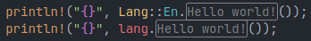

# Useful extensions

If you are using [Visual Studio Code](https://code.visualstudio.com/), here is some useful extensions you can use.

## Using with Rust Analyzer
[rust-analyzer](https://rust-analyzer.github.io/) is a popular extension providing completion and more for Rust files.
If the generated code is not correctly loaded, add the following line to the `.vscode/settings.json` file:

```json
"rust-analyzer.cargo.loadOutDirsFromCheck": true
```

## Using with i18n ally
[i18n ally](https://github.com/lokalise/i18n-ally) is an all-in-one i18n extension for VS Code that provide inline annotation of translated strings in your code.



*i18n ally* supports [custom translations frameworks](https://github.com/lokalise/i18n-ally/wiki/Custom-Framework) by adding a simple config file.
Because code generated by Rosetta looks like any Rust method, the following configuration will consider that any method of a variable named `lang`
or an enum named `Lang` is a translation key. It's not perfect as trait methods are also considered by the extension as translations keys, but it
work well in most case.

Create a `.vscode/i18n-ally-custom-framework.yml` file with the following content to enable Rosetta support. Edit this configuration if you are not
using `lang` as variable name.
```yaml
# .vscode/i18n-ally-custom-framework.yml
languageIds:
  - rust

usageMatchRegex:
  - "[^\\w\\d]Lang::[A-z]+\\.([a-z_]+)\\(.*\\)"
  - "[^\\w\\d]lang\\.([a-z_]+)\\(.*\\)"

# If set to true, only enables this custom framework (will disable all built-in frameworks)
monopoly: true
```
