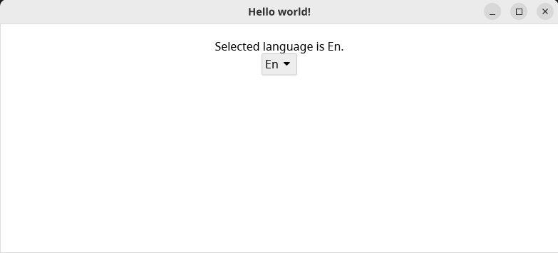

# Example using [Iced](https://github.com/iced-rs/iced)




### generated code:
```rust
pub enum Lang {
    Fr,
    En,
}

impl Lang {
    #[allow(clippy::all)]
    pub fn hello(&self) -> &'static str {
        match self {
            Lang::Fr => "Bonjour!",
            _ => "Hello world!",
        }
    }
    #[allow(clippy::all)]
    pub fn selected_language(
        &self,
        language: impl ::std::fmt::Display,
    ) -> ::std::string::String {
        match self {
            Lang::Fr => {
                let res = ::alloc::fmt::format(
                    format_args!("Le language selectionné est {0}.", language),
                );
                res
            }
            _ => {
                let res = ::alloc::fmt::format(
                    format_args!("Selected language is {0}.", language),
                );
                res
            }
        }
    }
}
```